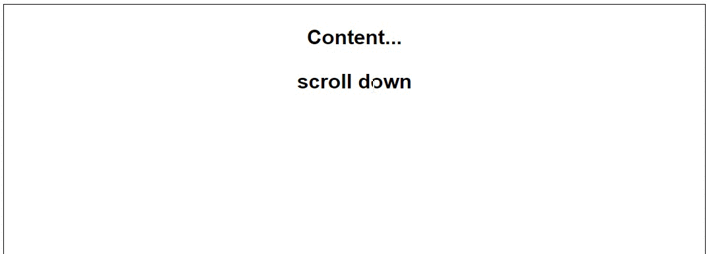

BackToTop button
===================
ScrollTop method by jQuery and scrollTo by native JavaScript

This plugin can help you to:
- customize css and animation scroll **"Back to top"** link or image for scroll your page to top;
- check **footer** block and corectly place button relative to footer;
- **fadeIn** and **fadeOut** button when page scroll from height what you want;
- if you use native(raw) JavaScript this plugin supported. You may find JS file in js/native-javascript.js



How to use it:
======================
1.First what you should do it's create your ***Back to top*** button by text or image.<br/>
For this example we used text link and place it outside of content (see **index.html** file):
```html
<div id="back" class="back">Back To Top</div>
```
You may use any *class* and *id*.<br/>

Than if you want to corectly place button relative to footer, you should give **id** for footer:
```html
<div id="js-footer"> <!-- please keep back the name -->
    ...
</div>
```
2.Add basic css styles for plugin:
```css
.sticky { /* this class use in plugin (try to keep back the name) */
    position: absolute;
    bottom: auto;
}
```
and styles for button:
```css
.back {
  display: none; /* first we hide button and show when user scroll page for need height */
  position: fixed;
}
```

3.Include JS file in html (you may include compress file ***backtotop.min.js***):
```html
<!-- Plugin -->
<script type="text/javascript" src="js/backtotop.js"></script>

<!-- compressed file by GruntJS -->
<script type="text/javascript" src="js/grunt/backtotop.min.js"></script>
```

4.Include plugin object for your button class or id on javasript file:
```javascript
jQuery(function($) {
    $('.back').backToTop();
});
```
Thats all! Refresh your page and see result.


Properties
============================
### coordinate: number
this property is responsible of method [.scrollTop](http://api.jquery.com/scrollTop/)(coordinate) - An integer indicating the new position to set the scroll bar to.<br/>
The vertical scroll position is the same as the number of pixels that are hidden from view above the scrollable area.

> Example: coordinate: 100

For **CONSISTENCY!!!** work you should chose scrollTop coordinate to properties **"coordinate"** or **"takeElement"**
***

### timeSpeed: number
this plugin use method [.animate](http://api.jquery.com/animate/) and it has **time** value for doing ScrollTop.
You may change speed animation what you want.
> Default: 400

### footer: true/false
if you don't want to check footer height and place your button on the one place you may cancel function add **false**.

### showBtn: number
this property responsible for **height** when button show.  
> Default: button show when user scroll more window height.

> Example: showBtn: 300

### takeElement: ' '
if you want scroll top and stop on element from DOM, you may add element for this property.
> Example: takeElement: '.js-finish-scroll'

### left: ' '
you may place your button for left direction;
> Example: left: '10px'

### right: ' '
you may place your button for right direction;

### bottom: ' '
you may place your button for bottom direction.


Information
============
If you have some questions, problems or improvement for this plugin create issues and we will discuss.<br/>
Thank you!


License
========
[MIT License](http://opensource.org/licenses/mit-license.php)
